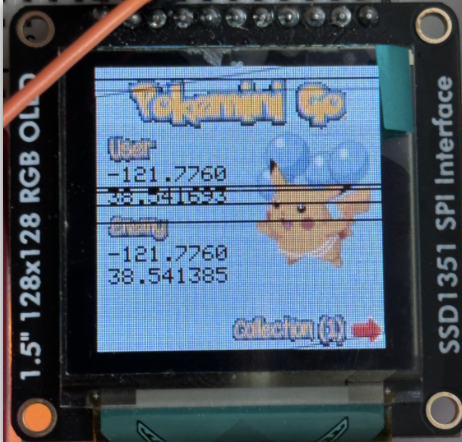
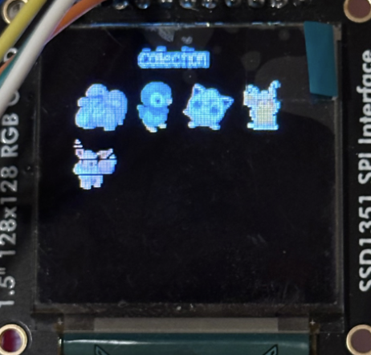
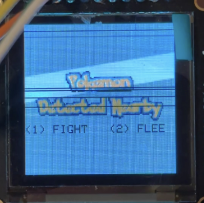
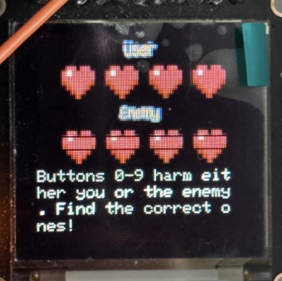
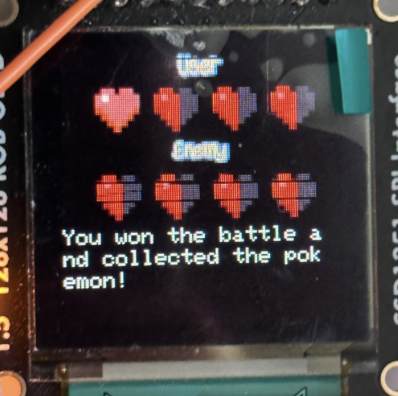
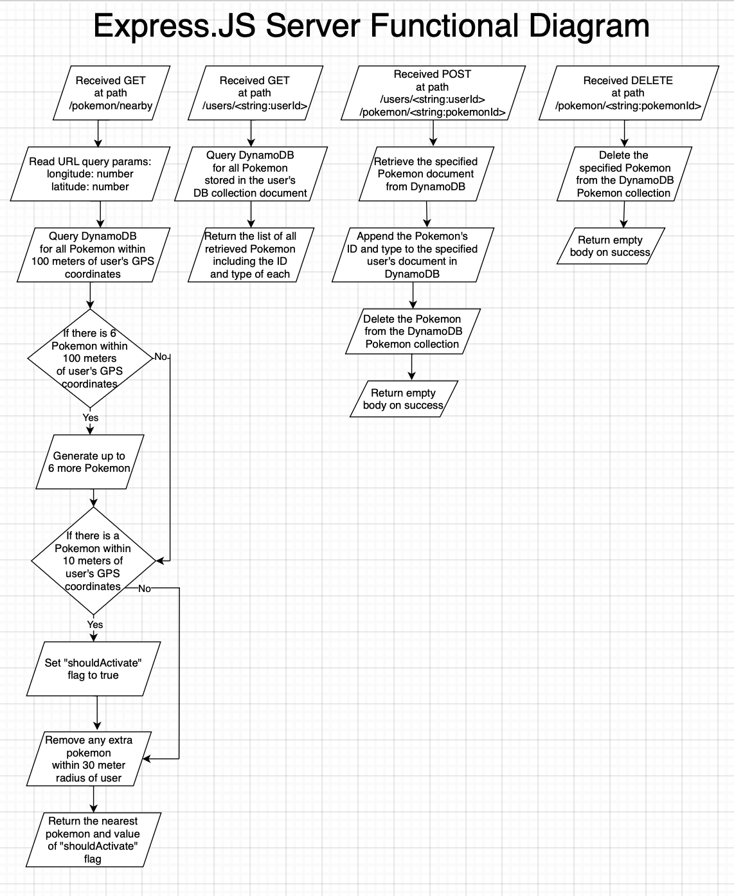
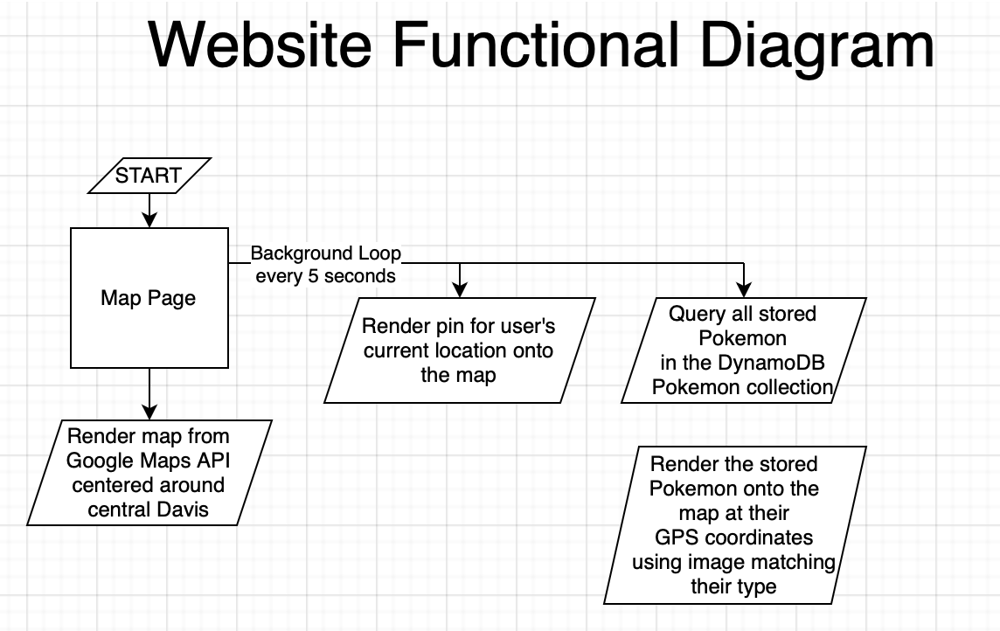
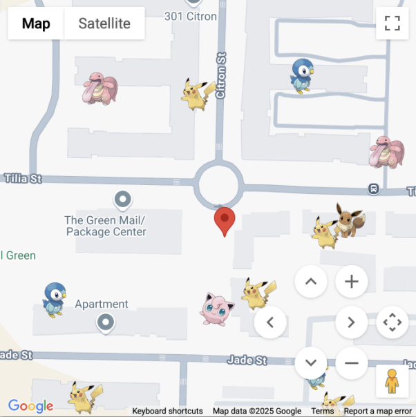
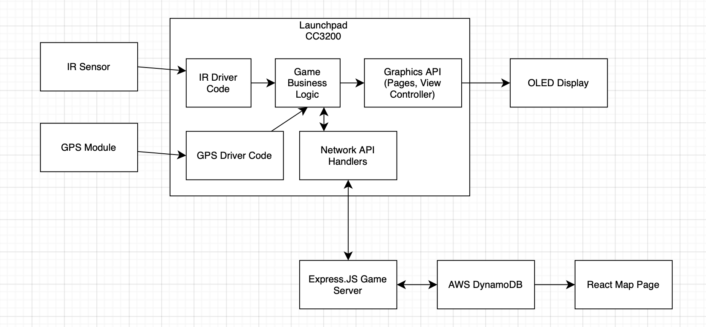

# Design

## Functional specification

### LaunchPad


As specified in the **Description** section, a state machine transitioning
between 4 different pages is implemented. These four pages are the landing page,
the collection page, the fight-or-flee page, and the fight page.

To begin with, when the board is powered on, the system does not transition to
one of the 4 pages just yet, but instead enters a loop to attempt connecting to
the pre-configured WiFi network. In this loop, the text `Connecting to Wifi...`
is printed on the top of the OLED screen. Then, when the LaunchPad is finally
able to connect to the specified network, then the state transitions into the
initial landing page.

In the landing page, we display the title "Pokemini Go" in a custom font, with a
picture of a Pikachu Pokémon in the bottom right. Then, we also show the user's
GPS coordinates and the enemy's GPS coordinates on the left of the screen. On
the bottom of the screen, we show an indication that pressing the number button
`1` on the IR remote will switch pages to the collection page.



In the collection page, we show a grid of Pokémon icons corresponding to all of
the Pokémon that the user has collected. These Pokémon are stored in the
DynamoDB document corresponding to the current LaunchPad. Upon accessing the
collection page, an HTTP GET request to route `/users/<string:userId>` is sent
to the Express.JS server to retrieve all of the Pokémon in the user's
collection. The `userId` is uniquely given by the MAC address of the LaunchPad's
WiFi chip, serialized into a hexadecimal string. From the collection page, the
user can navigate back to the landing page by pressing the number button `2` on
the IR remote.



In either the landing page or the collection page, a loop is run in the
background where approximately every 5 seconds, the nearby Pokémon are queried
from the Express.JS server. This query is executed by making an HTTP GET request
to the route `/pokemon/nearby` on the Express.JS server.

The response from the server includes the GPS coordinates of the nearest Pokémon
to the LaunchPad, the ID of the Pokémon, and also a boolean flag named
`shouldActivate` indicating whether that Pokémon is near enough to the LaunchPad
to trigger a "fight-or-flee" activation. The new enemy's GPS coordinates are
applied to the landing page state. Then, if `shouldActivate` is true, a state
transition is triggered to enter the fight-or-flee page.



In the fight-or-flee page, we render text "Pokemon Detected Nearby" in a custom
font in the center of the screen. Then right below, we indicate that the user
can press the numeric button `1` on the IR remote to fight the Pokémon, or that
they can press the numeric button `2` on the IR remote to flee the Pokémon.

While in the fight-or-flee page, the background loop of querying for nearby
Pokémon is halted. This way, the LaunchPad does not receive a duplicate
notification to fight another Pokémon. The fight-or-flee page will stay active
until the user takes an action to navigate away from it.

If the user presses `2` to flee the Pokémon, then an HTTP DELETE request is sent
to the route `/pokemon/<string:pokemonId>` with the given ID of the nearest
Pokémon that triggered the fight-or-flee page. This will cause the Pokémon to be
deleted from the DynamoDB store and thus from the map. Then, the LaunchPad state
will transition back to the landing page.

If the user presses `1` to fight the Pokemon, then the LaunchPad state
transitions to the fight page.

In the fight page, we render four hearts on the top of the screen representing
the user's health, and four hearts on the bottom of the screen representing the
enemy's health.

Then, we randomly assign the 10 numeric buttons on the IR remote to either
trigger the user's health to decrease by one, or the enemy's health to decrease
by one. To ensure that a win or loss is guaranteed without ties, we ensure that
5 of the buttons are assigned to decrease a user heart and that the other 5
buttons are assigned to decrease an enemy heart. Given the four hearts for each
user, each user starts with a health value of 4. By pressing a button, either
the user's health will randomly go down by 1, or the enemy's health will
randomly go down by 1. The IR remote's number button actions are set at random
whenever the fight state is entered. Then, when a number button is pressed, the
press is recorded. A number cannot be re-pressed within the fight page. Thus,
the user must exhaust all the number buttons until either the user loses all of
their hearts or the enemy loses all of their hearts.

While in the fight page, the background process for querying the server for
nearby Pokémon is halted. This way, the user will not be prompted to attack
another Pokémon while they are still battling the current Pokémon.



If the user loses all of their hearts, then the resulting behavior is similar to
that of if the user decided to flee in the fight-or-flee page.

That is, an HTTP DELETE request will be made to the route
`/pokemon/<string:pokemonId>` on the Express.JS server to delete the Pokémon
from the DynamoDB Pokémon collection, representing the Pokémon fleeing. Then,
the LaunchPad state will transition back to the landing page.

If the enemy loses all of their hearts, then an HTTP POST request will be made
to the route:

```
/users/<string:userId>/pokemon/<string:pokemonId>
```

This will cause the Pokémon to be removed from the DynamoDB Pokémon collection
and thus be removed from the map, but the Pokémon will then also be added to the
user's Pokémon collection, signifying that the user has collected that Pokémon.
Then, the LaunchPad state will transition to the collection page to show the
newly collected Pokémon.

Here, we show an image of what the fight page looks like immediately after the
enemy loses all of their hearts, indicating a user win:



### Express.JS server



The REST API server endpoint that processes the LaunchPad's network requests is
written in Express.JS, a common Node.JS framework for writing web server
applications. Node.JS is a server runtime that allows writing JavaScript or
TypeScript code in a server non-browser environment.

In Express.JS, API behavior is written in a declarative and asynchronous format,
where function handlers are given to each particular route that the server
should implement. For our application, we implement four distinct routes.


1. `HTTP GET` request to the route `/pokemon/nearby` will return the nearest
    Pokémon to the requesting user. We also include some lazy-loaded behavior
    within this call to manage Pokémon map state, as will be discussed later.
2. `HTTP GET` request to the route `/users/<string:userId>` will return a list
   of all Pokémon that are currently stored in the specified user's collection.
3. `HTTP DELETE` request to the route `/pokemon/<string:pokemonId>` will delete
   the specified Pokémon from the DynamoDB Pokémon collection, thus removing the
   Pokémon from the map.
4. `HTTP POST` request to the route
   `/users/<string:userId>/pokemon/<string:pokemonId>` will cause the specified
   Pokémon to be added to the specified user's collection, and for the Pokémon
   to also be deleted from the Pokémon collection to remove it from the map.
   This route is for "catching" the Pokémon.

For the `HTTP GET` request to the route `/pokemon/nearby`, the server expects
two URL query parameters included in the request: longitude and latitude numeric
values that correspond to the GPS coordinates of the requesting user. As an
example, a fully formatted call might have a URL that looks as follows:

```
http://<server_address>/pokemon/nearby?latitude=37.000000&longitude=-121.000000
```

If the query parameters are not given, then the web server returns a `400 Bad
Request` error.

After parsing the user's coordinates, then the server queries DynamoDB for all
Pokémon within a 100-meter radius of the user's GPS coordinates. If there are
less than 6 Pokémon within the 100-meter radius of the user's coordinates, then
the server requests for more Pokémon to be created such that the 6 Pokémon
threshold quantity is met. These new Pokémon are created at a radius of at least
30-meters away from the user, and within the 100-meter outer radius. The Pokémon
are generated at least 30-meters away so that the user does not immediately
trigger a fight with another Pokémon, where we force the user to walk in order
to reach fighting radius of a newly generated Pokémon. In the server, we set the
fight activation radius to be 10-meters. That is, if the server calculates that
the user is within 10-meters of the closest Pokémon, then the flag
`shouldActivate` is set to true in the response to indicate that the LaunchPad
should transition to the fight-or-flee page.

We set the spawning radius to be 30-meters instead of 10-meters away from the
user's GPS coordinates to give a margin of 20-meters. This margin accounts for
the imprecision of the GPS sensor on the LaunchPad, where the position slightly
jumps around as the local coordinates are polled. This way, we can prevent an
accidental immediate trigger of a Pokémon that is truly outside of the user's 10
meter activation radius, but that otherwise may have been accidentally triggered
due to the user's GPS coordinates being transiently reported as closer to the
Pokémon than the user actually is.

Finally, before returning the nearest Pokémon information, all of the additional
Pokémon inside of the 30-meter margin-activation radius are removed from the
DynamoDB Pokémon collection. That is, if there is a single Pokémon inside of the
30-meter radius, then that Pokémon is returned and not deleted. If there is more
than one Pokémon inside of the 30-meter radius, then the closest of those
Pokémon is returned, and then the other Pokémon are deleted. If there are no
Pokémon inside of the 30-meter radius, then trivially none of the Pokémon are
deleted.

The reason for this behavior is so that after the user fights or flees the
nearest Pokémon inside of their 10-meter activation radius, then the user will
not be immediately triggered to fight another Pokémon that is also within the
margin-activation radius.

Finally, the nearest Pokémon is then returned to the user.

For the `HTTP GET` request to `/users/<string:userId>`, the server queries
DynamoDB for the list of all Pokémon that are stored in the user's document.
These Pokémon are then simply returned back to the user.

For the `HTTP POST` request to
`/users/<string:userId>/pokemon/<string:pokemonId>` the specified Pokémon is
retrieved from the DynamoDB Pokémon collection, deleted from the Pokémon
collection, and then re-inserted into the user's document.

For the `HTTP DELETE` request to `/pokemon/<string:pokemonId>`, the specified
Pokémon is directly deleted from the DynamoDB Pokémon collection.

For each of the above calls, the lower-level details of the response format is
discussed in the **Implementation** section.

### Website



For the website that we implement, we use the React.JS website framework and
Vite packaging system to implement a world-map interface that shows all of the
Pokémon and their locations in close to realtime.

In particular, we leverage the Google Maps API to render a React component for a
Google Map that uses the full view-port of the browser window. Then, we render a
pin for the user's current location onto the map, and then we render all of the
Pokémon from the DynamoDB Pokémon collection onto the map, using downloaded
images of the Pokémon and rendering those Pokémon to their respective GPS
coordinates on the map.

In a background loop, we update the user's shown location and the status of all
Pokémon every 5 seconds. In the accompanying website report to this final report
document, we embed our map into a page on that website.

Below we show an example of what our map looks like:



## System architecture



Zooming out from the specific implemented behavior, the high-level system
architecture involves the peripheral I/O devices connected to the LaunchPad, the
LaunchPad itself, the Express.JS server, the AWS DynamoDB schema, and the
React.JS map page.

To begin with, we consider both the IR sensor and the GPS module to be input
peripherals. The IR sensor detects button presses from the AT&T Universal IR
Remote and sends those inputs to the LaunchPad where the game business logic
then updates game state in response to those presses.

The GPS module continuously samples the user's GPS coordinates by using
satellite trilateration, and then sends these samples to the game business logic
as well over UART.

Next, the output peripheral on the LaunchPad is the OLED display. We preprocess
downloaded images from the internet into RGB bitmaps that are stored in C
arrays. Then, these images are rendered onto the screen depending on game state.

As is described in the functionality section, we implement an Express.JS game
server that communicates bidirectionally both with the LaunchPad and also with
the AWS DynamoDB database.

Then, we implement a data schema for our DynamoDB tables. In particular, we use
two collections: a Users collection that stores one document per user, and a
Pokémon collection that stores one document per each spawned Pokémon on the map.

Finally, we implement a front-end map page using React.JS and the Google Maps
API which reads the data stored in AWS DynamoDB to visualize the global state of
the game on the map.

The implementation details for each of these major components are discussed in
the **Implementation** section.
