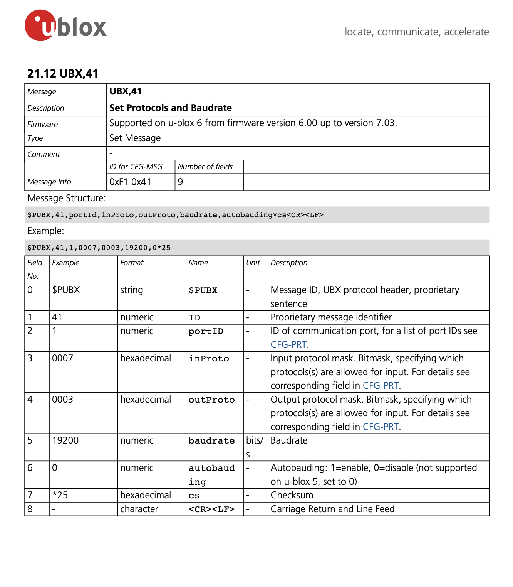
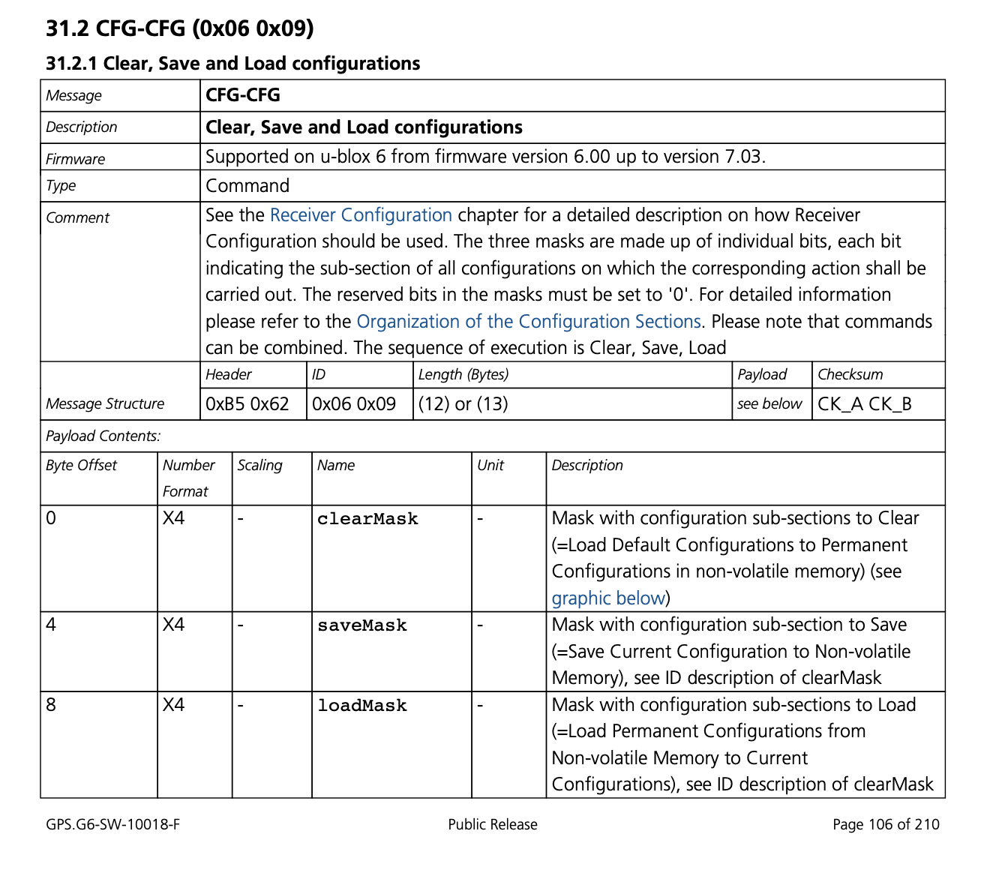
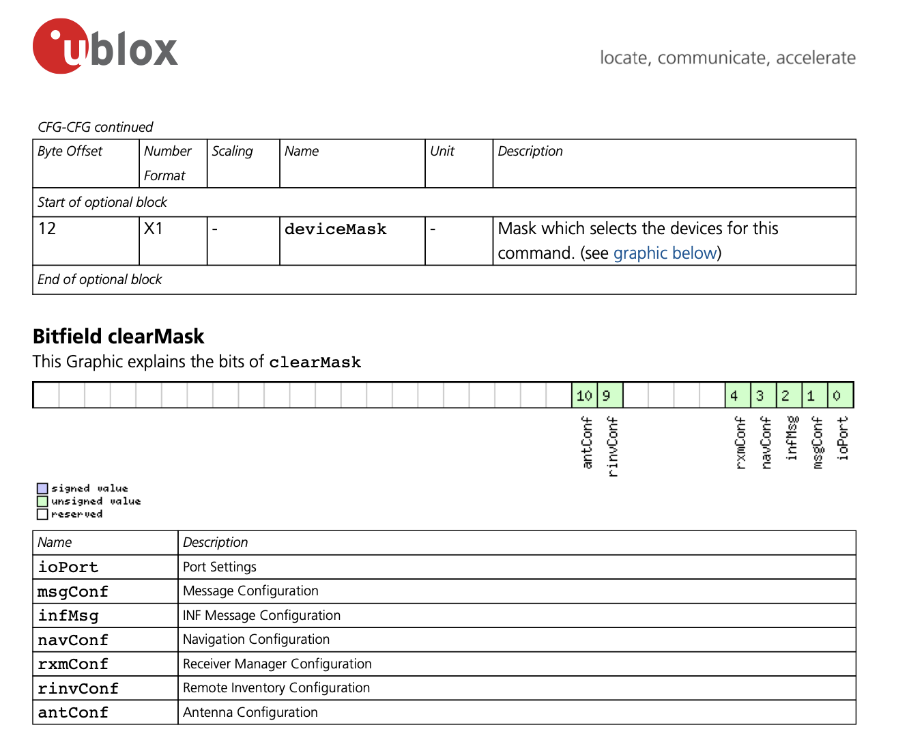
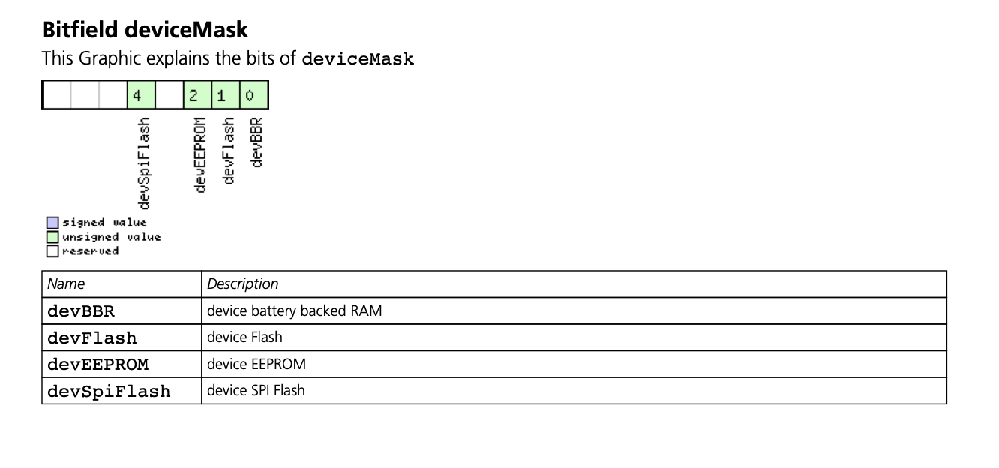
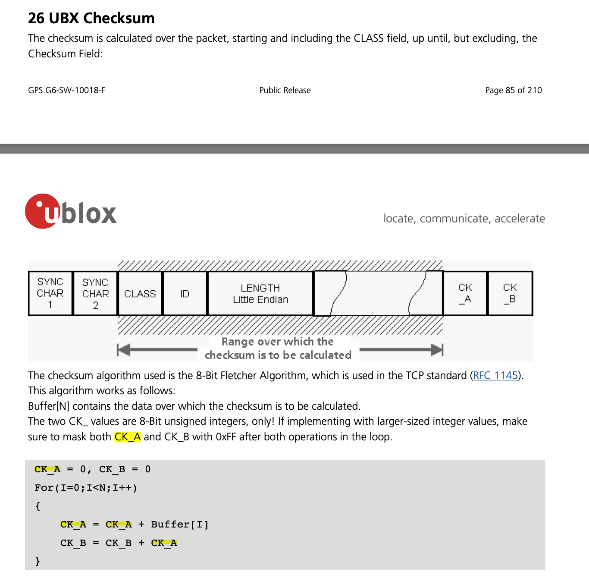
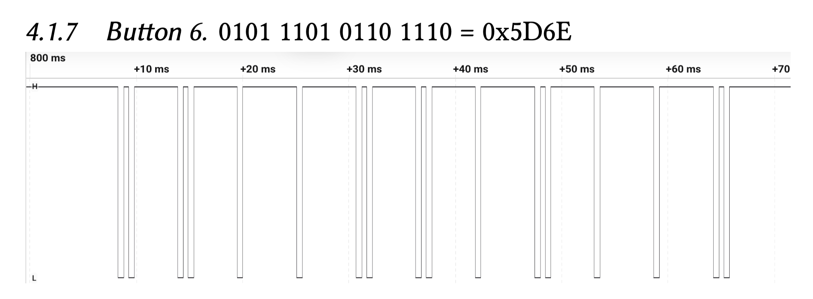
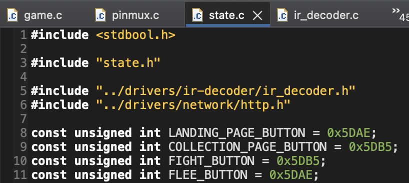

# Implementation

## GPS driver code

### Configure UART interrupts

The GPS module uses the UART protocol to transmit data. To set up communication
between the CC3200 LaunchPad and GPS module, we enable UART1 on SysConfig and
configure GPIO 11 (Pin 02) as the RX pin and GPIO 03 (Pin 58) as the TX pin. In
our circuit, we connect UART1 RX and TX pins on the LaunchPad to the TX and RX
pins of the GPS module, respectively. To implement UART interrupts, we closely
reference our implementation from Lab 3 ("IR Remote Control Texting Over a UART
Link") and the [UART API](https://software-dl.ti.com/ecs/cc31xx/APIs/public/cc32xx_peripherals/latest/html/group___u_a_r_t__api.html).
For UART data transmissions, the CC3200 utilizes a 16-byte receive FIFO buffer.
When GPS data is written to the RX pin of UART1, each byte is appended to the
FIFO buffer, from which we read the data. We use `UARTFIFOLevelSet` to assign
the receive FIFO interrupt level as `UART_FIFO_RX4_8`. As a result, an interrupt
is generated for every 8 bytes written to the receive FIFO buffer.

### UART interrupt handler

For every 8 bytes written to the receive FIFO butter, the UART interrupt handler
is executed. This interrupt service routine is responsible for reading the
NMEA-0183 sentences. When a sentence of type "GNGGA" is read, it parses the
latitude and longitude to assign to the game state.
[Aceinna OpenRTK Developer manual](https://openrtk.readthedocs.io/en/latest/communication_port/nmea.html)
provides an example of a "GNGGA" sentence from the NMEA-0183 standard. We
include that example for reference below. It is a comma-delimited sentence that
starts with `$` and ends with `\r\n`.

```
$GNGGA,072446.00,3130.5226316,N,12024.0937010,E,4,27,0.5,31.924,M,0.000,M,2.0,*44 
```

For each byte in the receive FIFO buffer, `UARTCharGet` is used to read the
character and remove it from the buffer. We declare a `volatile` array of `char`
named `rx_buffer` that is large enough to store a single NMEA-0183 sentence. We
also declare `rx_buffer_idx` – a variable to store the current length of the
NMEA-0183 sentence that we are reading. When we read `$`, we also write the
following bytes to a second `volatile` buffer, named `sentence_type`, until we
reach the first comma delimiter.

Reading `\n` indicates that we have finished reading an entire NMEA-0183
sentence to `rx_buffer`. We check if `sentence_type` stores the string `GNGGA`.
If so, we parse `rx_buffer` to obtain the latitude and longitude. Afterwards, we
reset `rx_buffer_idx` to zero, so we can read a new NMEA-0183 sentence to
`rx_buffer`.

### Parse `rx_buffer`

When an entire "GNGGA" sentence has been read to `rx_buffer`, we use `strtok` to
parse the comma-delimited string into an array of `tokens`. To check if this is
a valid GPS reading in North America, we confirm that fourth field – direction
of latitude – and sixth field – direction of longitude – are "N" (i.e., north)
and "W" (i.e., west), respectively. We also confirm that the latitude and
longitude are not empty fields, which can occur when the GPS failed at finding a
fix.

According to [Trimble's guide on NMEA-0183 messages](https://receiverhelp.trimble.com/alloy-gnss/en-us/NMEA-0183messages_CommonMessageElements.html#:~:text=NMEA%20Message%20values&text=Latitude%20is%20represented%20as%20ddmm,dd%20or%20ddd%20is%20degrees),
an NMEA-0183 sentence formats the latitude as "ddmm.mmmm" and longitude as
"dddmm.mmmm", where "dd" and "ddd" represent degrees while "mm.mmmm" denote
minutes. We reference this [StackOverflow answer](https://stackoverflow.com/questions/36254363/how-to-convert-latitude-and-longitude-of-nmea-format-data-to-decimal)
to convert the values to decimal degrees – a common way to express latitude and
longitude values. After converting the strings to floats, we divide the minutes
by 60 and add this quotient to the degrees. Since North America is located in
the western hemisphere, we negate the latitude. 

### Set baudrate

By connecting the LaunchPad's UART1 TX pin to the GPS module's RX pin, we can
write commands to the GPS module for configuration. By default, our GPS module
communicates at a baud rate of 115200. Initially when we attempted sending the
GPS module's generated NMEA sentences to the LaunchPad using the default 115200
baud, we noticed that the messages were being received incomplete. Notably,
sentences would be received cut-off such as in the following example:
`$GNGGA,072446.00`. Here, only the timestamp of the GNGGA sentence is being
received, but otherwise the 16 character FIFO buffer is filled up and unable to
receive the rest of the message before the LaunchPad code is fast enough to read
the buffer. By halving the baud to 57600, we were able to slow the message
transmission enough to allow the LaunchPad to read the message faster than it is
transmitted.

Changing the baud is an involved process. Firstly, the specific GPS module that
we use is the [HGLRC M100-5883](https://www.hglrc.com/products/m100-5883-gps?srsltid=AfmBOor17IWhtMt4P6nsx0QI5u1bGGEDSzH--SjuEkOcAcFVDiZUdRY5). 
This package specifically uses the [UBlox M10 series baseband GPS chip](https://content.u-blox.com/sites/default/files/MAX-M10S_DataSheet_UBX-20035208.pdf).
That chip uses the [UBlox Protocol](https://content.u-blox.com/sites/default/files/products/documents/u-blox6_ReceiverDescrProtSpec_%28GPS.G6-SW-10018%29_Public.pdf)
which specifies the supported NMEA output as well as the format for configuring
the chip itself.

For configuring the baud rate on the UBlox chip, first we reference section
21.12 of the [UBlox protocol specification](https://content.u-blox.com/sites/default/files/products/documents/u-blox6_ReceiverDescrProtSpec_%28GPS.G6-SW-10018%29_Public.pdf) 
which specifies sending a UART message to the RX pin of the UBlox chip with
header `$PUBX,41,1`. Then, as shown in the following screenshot from the
documentation, we append the fields `,0007,0003` to update UART baudrate
specifically. 



Then, we append `,57600` to specify the new baudrate. Next, we append `,0` as
the default option for "autobauding," which we do not concern ourselves with.
Finally, we must calculate and append a checksum value beginning with an
asterisk and then followed by the one-byte checksum value in hexadecimal format.

In this case, the command string is:

```
$PUBX,41,1,0007,0003,57600,0
```

For the UBlox checksum, we calculate the XOR8 checksum. The XOR8 checksum simply
takes each byte of the message and then computes the bitwise exclusive-or
operation on each successive byte, returning a final checksum byte. We use
[this online tool](https://www.convertcase.com/hashing/xor-checksum)
to calculate the checksum for `PUBX,41,1,0007,0003,57600,0` which is the same
command string as above except without the leading $ character.

Thus, the resulting checksum in hexadecimal is `2b`. Finally, this is appended
to the original message to result in a final command message of
`$PUBX,41,1,0007,0003,57600,0*2b`.

After this command is sent to reconfigure the baudrate of the GPS module, we
then change the UART controller configuration for the UART1 interface to use
57600 baud by calling the `UARTConfigSetExpClk()` function as follows:

```
MAP_UARTConfigSetExpClk(
    UARTA1_BASE,
    MAP_PRCMPeripheralClockGet(PRCM_UARTA1),
    57600,
    (UART_CONFIG_WLEN_8 | UART_CONFIG_STOP_ONE |
     UART_CONFIG_PAR_NONE)
);
```

After updating the baudrate value, we restart the program, but while keeping the
LaunchPad and thus the GPS module powered throughout, ensuring not to lose the
temporarily updated baudrate.

We then attach a Saelee logic analyzer to the RX pin of the GPS module and
capture a sample NMEA sentence to ensure that the baudrate remains at 57600.

Next, we construct a command to save the configuration of the GPS module to the
GPS module's onboard non-volatile memory.

In particular, we reference the following [UBlox protocol section 31.2.1](https://content.u-blox.com/sites/default/files/products/documents/u-blox6_ReceiverDescrProtSpec_%28GPS.G6-SW-10018%29_Public.pdf)
which instructs transmitting a UART message to the UBlox chip RX pin with header
bytes `0xB5 0x62 0x06 0x09`. 



Then, we append the byte `13` in decimal to indicate a payload length of 13
bytes. Finally, we append the payload of 32 `0` bits for the `clearMask` and
`loadMask` values, and then bytes `0xFF 0xFF 0x00 0x00` for the `saveMask`.
According to the following screenshot from section 31.2.1, setting the lower two
bytes to all ones will cause all of the GPS module's current configuration to be
saved: 



Then, according to the bottom of section 31.2.1, we set the 13th bit of the
payload to `0xF` to flash the configuration to all the available memory sources,
importantly including the non-volatile sources: 



Finally, this command takes two separate checksum values. The two checksums are
likely because the command is critical to receive correctly; a corrupt saved
configuration would essentially brick the GPS module unless the user is
successfully able to reverse engineer and then communicate with the corrupted
configuration.

The two checksums `CK_A` and `CK_B` are computed as follows:



CK_A and CK_B are appended to the payload.

Finally, this entire message is written at once to the UBlox chip over UART. We
remove power from the GPS module for 10 seconds and then re-attach power to
ensure that the new baudrate is permanently stored in non-volatile memory.

### Disable and re-enable interrupts

The HGLRC UBlox GPS module sends approximately 15 NMEA sentences, each 10 times
per second. Each NMEA sentence is around 50 characters. Approximately 7500 bytes
per second of constantly interrupting the LaunchPad causes a resource hogging
problem where other program behavior, such as network requests and OLED screen
updates, either don't run predictably or stop working for long periods of time.

To fix this, we implement a solution where the UART1 RX buffer interrupt handler
is initially disabled, and then remains disabled until approximately 2 seconds
pass. We hand-tune this interval, eventually settling on a constant in our
`gpg.c` file that we define as `const int GPG_READ_LIMIT = 60000`. How this
works is that on every iteration of our main game loop in `game.c`, a function
`PollEnableGPS()` is called which will increment a counter `gpg_read_timeout`.
Then, when `gpg_read_timeout` reaches `GPG_READ_LIMIT` the UART1 RX buffer
interrupt handler is re-enabled, allowing the board to respond to and process
the influx of GPS NMEA sentences. Then, when the GNGGA sentence is fully parsed,
the UART1 RX buffer is disabled again. This strategy allows the board to sample
the GPS NMEA sentences at a much slower rate that is acceptable, allowing other
program processes to have enough time to execute successfully at their own
respective rates.

## IR sensor

To decode the AT\&T IR remote transmissions, we copy over our solution from Lab
3 ("IR Remote Control Texting Over a UART Link"). In particular, we use an AT&T
S3 Universal Remote configured with TV code `1005`. This remote with the given
TV code generates binary pulse-width modulated signals that uniquely identify
each button press. The duty cycle is near 100% as can be seen in the following
example transmission: 



We use the CC3200 Timer API to implement an interrupt-based system for measuring
the pulse-width of each transmitted symbol. In particular, we configure GPIO
interrupts to run on both the rising and falling edges of GPIO pin 62. We
configure the first hardware timer `PRCM_TIMERA0` to reset on each rising edge,
and then on the next falling edge we record the elapsed time. We consider a
short pulse-width (less than 300 microseconds) to be a `0` bit, and a long
pulse-width (over 3 milliseconds) to be a `1` bit. The AT&T remote sends a
unique 16-bit code for each button. We only need to use the number keys, so we
collect the unique codes for each number key and then define constants for these
16-bit codes. As shown, numeric button 1 corresponds to code `0x5DAE`, which
gets mapped to navigation into the landing page and to the fight button in the
Fight-or-Flee page. Numeric button 2 corresponds to code `0x5DB5`, which gets
mapped to navigation into the collection page and to the flee button in the
Fight-or-Flee page.



Then, we define the `PRCM_TIMERA0` expiry interrupt at 20 milliseconds. We have
the handler reset the read IR bits. This way, we can reset partially-completed
transmissions or transmissions with errors after the completion of an IR remote
transmission but before the beginning of the next transmission.

After all 16 bits from a particular IR remote transmission have been read, then
the two bytes are written to a volatile integer value named `encoding`, and then
a volatile boolean variable `transmission_complete` is set to true to indicate
that a button press has been fully received and parsed. Procedures from the
active state in the main game loop read the `encoding` variable once, then set
`transmission_complete` to true, and then finally reset `transmission_complete`
back to false.

## React map page

The map page for the website is implemented in TypeScript using the React.JS web
component framework and the Vite packager with `SWC` (Speedy Web Compiler)
optimizations. Specifically we use the following `npm` command to create the
project:

```
npm create vite@latest pokemini-website --\
  --template react-swc-ts
```

In this application, we use the `react-router@7` npm package to implement
handling the different pages on the website. For simplicity sake, we simply
define a single route with a `HashRouter`, thus meaning that we render our
`<Map/>` component to the URL

```
https://server.nicbk.com/#/map
```

Thus, our main page layout looks as follows:

```
<HashRouter>
  <Routes>
    <Route path="/map" element={<Map />} />
  </Routes>
</HashRouter>
```

As such, we define our map page using the `<Map />` component. We set the global
CSS style on the body element to have properties

```
body {
  margin: 0;
  padding: 0;
}
```

to ensure that the map fluidly takes up exactly the whole browser viewport.

Then, we import the `@vis.gl/react-google-maps@1.5.2` npm package, which
provides React hooks and components to easily render Google Maps visualizations
onto the React virtual-DOM (Document-Object Model). Using this library, we add a
Google Maps interface into the Map page that takes up the whole viewport size.
Then, we set the center view of the map to be at GPS coordinates

```
lat: 38.538496,
lng: -121.757724
```

which is approximately at the center of UC Davis campus.

Then, we add an `<AdvancedMarker />` component, to the user's GPS coordinates,
which drops a pin onto the map at the specified coordinates.

Using the `@aws-sdk/client-dynamodb` and `@aws-sdk/lib-dynamodb` libraries, we
retrieve all Pokemon from the DynamoDB Pokemon collection and render each Pokemon
onto the map using `<AdvancedMarker />` components at their respective GPS
coordinates. Finally, we download transparent images for each of the five
supported Pokemon types (Pikachu, Eevee, Lickitung, Piplup, Jigglypuff) and we
set the `<AdvancedMarker />` icon for these Pokemon to be their respective
images.

All of the `<AdvancedMarker />` components (both the user pin and all the
Pokemon pins from DynamoDB) are set to update every 5 seconds.

## Game business logic

### Global state and state types

When we begin our program, we initialize the following fields in our global
state.

1. `state_type`: the current page state our game is in. (INIT to STATE_LANDING_PAGE)
2. `socket_id`: the socket ID returned by `sl_Connect`. (INIT to 0)
3. `mcu_latitude`: the latitude read from the GPS sensor in decimal degrees. (INIT to 0)
4. `mcu_longitude`: the longitude read from the GPS sensor in decimal degrees. (INIT to 0)
5. `mcu_id`: the MAC address of the LaunchPad. (INIT to 0; the MAC address is retrieved in the `SetupNetwork()` call)
6. `enemy_uuid`: the UUID of the nearest Pokémon. (INIT to 0)
7. `enemy_type`: the type of the nearest Pokémon. (INIT to 0)
8. `enemy_longitude`: the longitude of the nearest Pokémon in decimal degrees. (INIT to 0)
9. `enemy_latitude`: the latitude of the nearest Pokémon in decimal degrees. (INIT to 0)
10. `should_fight`: true if the user is within the 10-meter activation radius of the Pokémon; false otherwise. (INIT to false)
11. `local_hearts`: the number of hearts the current user has. (INIT to 4)
12. `enemy_hearts`: the number of hearts the nearest Pokémon has. (INIT to 4)
13. `collection`: an array of Pokémon the user has collected; each Pokémon is represented as a struct that stores the Pokémon UUID and type. (INIT to {0})
14. `collection_length`: the number of Pokémon in the user's collection. (INIT to 0)

In regards to `state.state_type`, there are four possible states in which
our game can be: the home state, collection state, fight-or-flee state, or fight
state. In our code, we define these states as the following:

```
enum StateType {
    STATE_LANDING_PAGE,
    STATE_FIGHT_OR_FLEE_PAGE,
    STATE_FIGHT_PAGE,
    STATE_COLLECTION_PAGE,
};
```

When a new state has been assigned to `state.state_type`, we set
`state.first_run` to true. `state.first_run` is used to check whether
we should draw the page on the OLED. After iterating through the game loop once
and rendering the new state, we set `state.first_run` to false, so we can
avoid re-rendering a static page on the OLED each time state in that page
updates. According to our game loop below, the game state determines which page
to render and logic to perform.

```
void GameLoop(void)
{
    while (true) {
        switch (state.state_type) {
        case STATE_LANDING_PAGE:
            LandingState();
            break;
        case STATE_FIGHT_OR_FLEE_PAGE:
            FightOrFleeState();
            break;
        case STATE_FIGHT_PAGE:
            FightState();
            break;
        case STATE_COLLECTION_PAGE:
            CollectionState();
            break;
        }
        ...
    }
}
```

If we are in `STATE_LANDING_PAGE`, the function `LandingState()` is executed.
This function checks if `state.first_run` is true. If so, it draws the static
images for the home page on the OLED. While there are no nearby Pokémon to
trigger the "fight or flee" page, the user will remain on the landing page
unless they switch to the collection page, and `LandingState()` keeps executing
for every iteration of the game loop. This function also reads 
`state.mcu_latitude` and `state.mcu_longitude`, and writes these values to the
display if any digits have changed. These `mcu` state variables represent the
GPS coordinates of the launchpad. As is discussed in the earlier GPS module
description, after every 60000 iterations of the game loop we enable the GPS
UART interrupt to update `state.mcu_latitude` and `state.mcu_longitude`. For
each call to `LandingState()`, we read the boolean variable
`transmission_complete`, which indicates whether the IR decoder has read a valid
signal from the remote. If `transmission_complete` is true and the encoding maps
to button 1, then the user has switched from the landing page to the collection
page. Therefore, we update `state.state_type` to `STATE_COLLECTION_PAGE` and set
`state.first_run` to true. The next iteration of the game loop will render the
collection page on the OLED.

When we render the collection page, we iterate through the array
`state.collection` of type `struct PokemonCollectionItem`.

```
struct PokemonCollectionItem {
    char id[64];
    enum PokemonType type;
};
```

As we iterate through the collection, we read `type` to determine which
character sprite to draw onto the OLED. There are five possible Pokémon types:
`POKEMON_JIGGLYPUFF`, `POKEMON_PIKACHU`, `POKEMON_PIPLUP`, `POKEMON_LICKITUNG`,
`POKEMON_EEVEE`. Using logic similar to the landing page, we keep executing
`CollectionState()` for every iteration of the game loop. At the end of each
function call, we check if `transmission_complete` is true and if the IR button
`encoding` variable maps to button 2. If true, then the user has switched from
the collection page to the landing page. Therefore, we update `state.state_type`
to `STATE_LANDING_PAGE` and set `state.first_run` to true. The next iteration of
the game loop will render the landing page on the OLED.

When in either `STATE_LANDING_PAGE` or the `STATE_COLLECTION_PAGE`, the main
game loop will execute the function `http_get_nearby_pokemon()`. After every
100,000 iterations of the main game loop, this function will make an HTTP GET
request to our Express.JS server at address
`http://server.nicbk.com:42812/pokemon/nearby`.

Then, the `getNearbyProcessMessage()` function will update the
`state.enemy_latitude`, `state.enemy_longitude`, and `state.should_fight`
fields of the global state after parsing the received data. This retrieval
period of 100,000 iterations of the main game loop is hand-tuned to be
approximately a 5 second interval.

### "Multi-thread" logic

We implement a crude system of co-operative multitasking by simply having a main
game loop named `GameLoop()` that is iterated through in an infinite loop.
Specifically, our loop is defined as follows:

```
void GameLoop(void)
{
    while (true) {
        switch (state.state_type) {
        case STATE_LANDING_PAGE:
            LandingState();
            break;
        case STATE_FIGHT_OR_FLEE_PAGE:
            FightOrFleeState();
            break;
        case STATE_FIGHT_PAGE:
            FightState();
            break;
        case STATE_COLLECTION_PAGE:
            CollectionState();
            break;
        }

        PollEnableGPS();

        if (state.socket_id) {
            http_get_nearby_pokemon(state.socket_id);
        }
        
        if (timeout < 10000) {
            ++timeout;
            continue;
        }
        timeout = 0;

        if (state.should_fight) {
            state.state_type = STATE_FIGHT_OR_FLEE_PAGE;
        }
    }
}
```

To recall, for each of the functions called in `GameLoop()`, we implement
timers that count iterations up to some pre-defined threshold before the actual
respective behavior for that function is actually executed. In this way, we
implement a system where each procedure only performs its intended action after
some pre-defined interval period, where in the meantime it simply just
increments a counter and then yields control back to `GameLoop()`. First, we
first enter the function corresponding to handling logic specific to the
currently active page state. As is discussed earlier, we have a boolean
variable `state.first_run` that is initially set to false right before
transitioning to a new state, and which is then set to true after the first
iteration of that particular state function completes. In this way we make the
initial state logic, including rendering to the OLED, only execute once for a
particular state. Then, after the logic for a single iteration of that state
function is finished, control is returned back up to the `GameLoop()`.

The next procedure to be run is `PollEnableGPS()`. As is discussed earlier, this
function only enables the GPS UART data handler after 60,000 main loop
iterations. What will happen is that `PollEnableGPS()` will immediately yield
control back to `GameLoop()` unless the counter `gpg_read_timeout` reaches
60,000. Then, when `gpg_read_timeout` reaches 60,000, then `PollEnableGPS()`
will enable the UART1 GPS RX interrupt handler, allowing the Launchpad to
process an NMEA GNGGA sentence before then disabling the UART1 GPS RX interrupt
handler again, and thus yielding time back to other interrupt handlers and other
synchronous logic.

Then, the next function in the main loop is the call to
`http_get_nearby_pokemon()`.

This function is only called if the `SetupNetwork()` function is `setup.c` has
successfully executed, ensuring that we have a valid socket initialized. As is
discussed earlier, we immediately yield control back to the game loop unless
100,000 iterations of the game loop have passed. Then, we make an HTTP GET
request to retrieve the information for the nearest Pokemon.

Finally, we add the if statement to "asynchronously" switch into the
fight-or-flee page into the bottom of the game loop. This check is triggered
after every 10,000 iterations of the game loop, which also helps to increase
efficiency by yielding to other procedures when necessary. As is discussed
earlier, the `state.state_type` field is only read for transition if in the
`STATE_LANDING_PAGE` or the `STATE_COLLECTION_PAGE`.

Finally, we delegate the remaining two pages: the fight-or-flee page and
the fight page to their own respective sub-sections in **Implementation** after
these following sections. This is because they have more complicated
functionality that requires more space to describe.

## DynamoDB database

DynamoDB is the AWS offering of a NoSQL database. That is, the database stores
collections of "documents", which are independent pieces of JSON data that can
be uploaded, queried, mutated, and deleted. We implement two collections
(also known as "tables") in our DynamoDB database: a "Users" collection of which
we give the identifier `UserTable` and a "Pokemon" collection of which we give
the identifier `PokemonTable`.

For consistency, we implement a document schema that documents inserted into
either table adhere to. For the `UserTable`, documents must have the following
JSON format:

```
{
  id (partition key): <string>,
  pokemonCollection: (array) [
    { (UserTable pokemon item)
      id: <string>
      type: <string>
    }
    ...
  ]
}
```

An example user document might look as follows:
```
{
  id: "a810876e2c7f",
  pokemonCollection: [
    {
      id: "be6e50de-b07e-4a78-a490-b2e51956cafa"
      type: "jigglypuff"
    },
    {
      id: "6a592984-d471-497b-b9da-d433eb1d92d9",
      type: "eevee"
    }
  ]
}
```

For the `PokemonTable`, documents must have the following JSON format:
```
{
  id (partition key): <string>,
  location: (gps coordinates) {
    latitude: <number>,
    longitude: <number>
  },
  type: <string>
}
```

An example Pokemon document might look as follows:
```
{
  id: "b8f691e8-0681-4c8f-bcb3-179253a1e7df",
  location: {
    latitude: -121.754973,
    longitude: 38.53739
  },
  type: "pikachu"
}
```

For Pokemon `id` fields, we generate random UUIDv4 identifiers. For user ID
fields, we construct the ID using the MAC address of the Launchpad WiFi chip
serialized to a 12-digit hexadecimal string.

## Express.JS game server

On our Express.JS server, we create API handlers for four different HTTP
requests: getting user data, getting the nearest Pokémon, adding a Pokémon to
the user's collection, and deleting a Pokémon. Although JSON is the most common
payload data format for structuring HTTP responses, we decide to separate fields
in our HTTP response with simple newlines and no JSON formatting to make it
easier to parse the response data in C.

### Get user

When the application is executed, the LaunchPad will immediately attempt to
connect to the access point and server. If a connection has been established, we
use `sl_NetCfgGet()` to retrieve the MAC address of the LaunchPad. The MAC
address serves as a unique identifier to differentiate users. Afterwards, we
make a HTTP GET request to retrieve user data from the following API route,
using the MAC address as a path parameter to define the user ID. 

```
/users/:userId
```

In our API handler, we check whether there is an existing user with that MAC
address identifier. If there is not yet an existing user for that MAC address,
we first create a new entry in `UserTable`, and their `userCollection` array is
initialized to be empty. Then, we return the user document in the
space-separated format as shown below:

We include an example of the returning payload when we retrieve user data for ID
"a810876e2c3f". This user has seven Pokémon in their collection. In addition to
the user's ID, the UUID and type of each Pokémon in their collection are
returned.

```
a810876e2c3f
09b81895-3403-4ec8-8871-2869d1610e52
piplup
5804c146-0c24-4d78-9f50-22791dc1ff2a
eevee
89756069-860f-4840-a9db-7bf11cf5e4d7
jigglypuff
7b171c47-479b-4eac-8db2-c79f67b254ed
pikachu
e6f13120-50a7-4b6d-bef5-6ad217a3339b
pikachu
3bb0052b-be9c-43da-b280-65be82637c6c
eevee
f430aa6b-3856-4573-bff4-698644a9efb8
piplup
```

In the above example response, the initial line is the ID of the requesting
user. Then, every Pokemon in the collection is 2 lines long, consisting of the
Pokemon ID and the Pokemon type. Since we can easily detect end-of-buffer in
the HTTP response handler, we don't need to explicitly specify the number of
returned pokemon.

### Get nearby Pokémon

While the user is on the landing page or collection page, we periodically make
HTTP GET requests to retrieve the coordinates of the nearest Pokémon. If there
are not enough Pokémon within a 100-meter radius of the user, the server adds
more nearby Pokémon to the database. Furthermore, if the user is within a
10-meter radius of the nearest Pokémon, a Fight-or-Flee page should be rendered.
On our Express server, this resource is located at the following API route,
where latitude and longitude are passed as query parameters. The API expects the
latitude and longitude to be in the format of decimal degrees.

```
/pokemon/nearby?latitude=<latitude in decimal degrees>&longitude=<longitude in decimal degrees>
```

An example request URL would look as follows:

```
http://<server_address/pokemon/nearby?latitude=37.123456&longitude=-121.123456
```

The API handler will first iterate through all Pokémon in the database and count
the number of nearby Pokémon. For each Pokémon, we use the Pythagorean distance
formula to calculate the Euclidean distance for how far that Pokémon is from our
board's current `latitude` and `longitude`.

$$
\begin{align*}
pLatitude &= pokemon.location.latitude \\
pLongitude &= pokemon.location.longitude \\
diff\_x &= |pLatitude - latitude| \\
diff\_y &= |pLongitude - longitude| \\
dist &= \sqrt{diff\_x^2 + diff\_y^2} \\
\end{align*}
$$

If `dist` is less than the `POKEMON_RADIUS` of 100-meters, we increment our
count of nearby Pokémon. We require at least 6 Pokémon to be located within the
user's 100-meter radius. Until the count reaches this threshold, we spawn more
Pokémon within the user's radius. 

To add a nearby Pokémon, we spawn it is within a 100-meter radius to the user
but outside an `ACTIVATION_RADIUS` of 10-meters. By spawning the Pokémon outside
the `ACTIVATION_RADIUS`, we require the user to walk to the nearest Pokémon.
Otherwise, the "fight or flee" page can trigger without physical movement from
the user. To account for GPS inaccuracies and prevent Pokémon from spawning
right at the 10-meter activation boundary, we create another constant
`ACTIVATE_RAD_WITH_MARGIN` and set it to 3 * `ACTIVATION_RADIUS`, which we use
to spawn new Pokémon at least 30-meters away from the user.

For our calculations, we generate a random radius between
`ACTIVATE_RAD_WITH_MARGIN` and `POKEMON_RADIUS` at which the Pokémon will spawn
from the user. Next, we generate a random angle between 0 to $2\pi$ radians,
which defines the direction from the user at which the Pokémon will spawn. This
defines the polar coordinates of the new Pokémon with respect to the user's
location.

$$
\begin{align*}
randRadius &= ACTIVATE\_RAD\_WITH\_MARGIN + Math.random() * \\
&\quad (POKEMON\_RADIUS - ACTIVATE\_RAD\_WITH\_ \\
&\quad MARGIN) \\
randAngle &= Math.random() * 2 * \pi
\end{align*}
$$

To calculate the latitude and longitude of the new Pokémon, we convert its
location from polar to cartesian coordinates. By using the formulas $x = r *
\cos{\theta}$ and $y = r * \sin{\theta}$, we calculate the change in $x$ and $y$
between the user and Pokémon. This change in $x$ is added to the user's
latitude, and the resulting sum is the latitude of the new Pokémon. Similarly,
the new Pokémon's longitude is calculated by adding the change in $y$ with the
user's longitude.

$$
\begin{align*}
xOffset &= randRadius * cos(randAngle) \\
yOffset &= randRadius * sin(randAngle) \\
newX &= latitude + xOffset \\
newY &= longitude + yOffset \\
\end{align*} $$

We define the array `POKEMON_TYPES` to specify the 5 possible characters that
can spawn: a Pikachu, Jigglypuff, Piplup, Eevee, and Lickitung. We generate a
random number between 0 to 4, which is used to index into `POKEMON_TYPES` and
assign a type to the new Pokémon. After generating a UUIDv4 with the `crypto`
library, we use the newly calculated latitude, longitude, and type to add the
new Pokémon to `PokemonTable` in AWS DynamoDB.

Once the minimum threshold for nearby Pokémon has been satisfied, we iterate
through all Pokémon once more and use the Pythagorean distance formula to
calculate the Pokémon's distance from the user. As we scan through the Pokémon,
we keep track of the nearest Pokémon and construct an array of Pokémon that are
within the user's 10-meter activation radius. Besides the nearest Pokémon, we
delete all other Pokémon that are within the user's 10-meter activation radius.
By doing so, we prevent multiple "fight or flee" pages from immediately
rendering one after another while the user remains stationary. The API handler
returns a payload that contains the nearest Pokémon's data and whether a "fight
or flight" page should activate.

When we request for the nearest Pokémon at latitude 38.537293 and longitude
-121.754578, we get the following response. According to the payload, the
`false` indicates that this Pokémon is not within the user's 10-meter radius, so
the "fight or flee" page should *not* be triggered. The following lines include
the nearest Pokémon's UUID, type, latitude, and longitude.

```
false
b5caa020-dd5f-432c-a8b4-cd9227c89e97
jigglypuff
38.537607926723126
-121.75439370435284
```

### Capture Pokémon

If the user has won the mini-game on the fight page, the Pokémon that had
activated the "fight or flee" page is appended to the user's collection. As a
result, we make a HTTP POST request to the following route. The user's MAC
address is passed as a path parameter for `:userId`. `state.enemy_uuid` – the
UUID of the nearest Pokémon that had activated the "fight or flee" page – is
used for `:pokemonId`.

```
/users/:userId/pokemon/:pokemonId
```

### Delete Pokémon

In addition to capturing a Pokémon, there are two other cases where a Pokémon
should be deleted: the user chose to flee on the "flight or flee" page, or the
user has lost the fight mini-game. For both cases, we make a HTTP DELETE request
to remove the Pokémon from the `PokemonTable` database. This resource is defined
at the following route, where the Pokémon's UUID is used as a path parameter to
define the Pokémon ID.

```
/pokemon/:pokemonId
```

This operation is performed on the nearest Pokémon that had activated the "fight
or flee" page. We store this Pokémon's UUID in `state.enemy_uuid`.

## Fight or flee

When we make HTTP GET requests for the nearest Pokémon, the response includes a
boolean that indicates whether that Pokémon is within the 10-meter activation
radius of the user. After parsing the response, the boolean is stored in
`state.should_fight`. While the user is on the landing page or collection page,
each iteration of our game loop checks whether this variable is set to true. If
so, `state.state_type` is changed to `STATE_FIGHT_OR_FLEE_PAGE`. As a result,
the next iteration of the game loop will render the "fight or flee" page, where
the user is informed that a nearby Pokémon has been detected. While the user is
on this page, the program keeps looping until it gets valid user input from the
IR remote. In particular, the user should select button 1 to fight or button 2
to flee. If the user selects to fight, `state.state_type` is assigned
`STATE_FIGHT_PAGE`. Otherwise, `state.state_type` is set to
`STATE_LANDING_PAGE`. The next iteration of the game loop will redirect the user
to the appropriate page based on their input.

## Fight mini game

When the user selects to fight the Pokémon on the "fight or flee" page, we
render the fight page on the OLED. The fight page displays bitmap images of
hearts to represent the health of the user and the enemy. Both the user and the
enemy start with four hearts each. Below the heart images, we render
instructions and fight results to guide the user through the game. Essentially,
the user utilizes the IR remote to select among buttons 0 to 9, and each button
press harms either the user or the enemy. Each digit button is mapped to one of
the following `GameButtonStates` states: `USER_BUTTON`, `ENEMY_BUTTON`, and
`TAKEN`. Pressing a button of state `USER_BUTTON` means that the user will win
the round, and the enemy will lose a heart. Similarly, pressing a button of
state `ENEMY_BUTTON` means that the enemy will win the round, and the user will
lose a heart. After an enemy or user selects a button, it is assigned the `TAKEN`
state.

When we initialize the fight, we iterate through the array
`enum GameButtonState game_buttons[10]` to randomly assign half of it with the
`USER_BUTTON` state and the other half with the `ENEMY_BUTTON` state. Then, we
render the instructions. When the user is done reading the rules, they can
select any digit button to start the game. Random numbers are generated using
the C standard library psuedorandom number generator `srand()`.

The user and the enemy take turns choosing a button until one of them reaches
zero hearts. The user makes the first move in the game. If the user chooses any
button other than 0 to 9, a message is displayed that an invalid button has been
pressed, and the user must choose from only buttons 0 to 9. If the user chooses
a button of state `TAKEN`, the OLED displays a message to choose an available
button, and it lists all the digit buttons that have been assigned `TAKEN`.

When it is the enemy's turn to make a move, the program keeps selecting a random
button from 0 to 9 until it finds a button that is *not* of state `TAKEN`. The
enemy uses this button as their move.

After the enemy or user makes a valid move, the OLED shows a message that states
which button has been selected, and whether that player has won or lost. When a
player loses a round, their heart count is decremented, and a bitmap image of a
broken heart replaces one of their full hearts.

If the user is the first player to lose all four hearts, a message is displayed
that the Pokémon has escaped. We assign `state.state_type` to
`STATE_LANDING_PAGE` to redirect the user to the landing page. Furthermore, we
make an HTTP DELETE request to remove the Pokémon from the database. The user
can select any button from 0 to 9 to exit the fight page.

If the enemy is the first to lose all their hearts, a message informs the user
that they have successfully collected the Pokémon. We set `state.state_type` to
`STATE_COLLECTION_PAGE` to redirect the user to the collection page, where they
can view the new Pokémon that has been added to their collection. We also make a
HTTP POST request to add the Pokémon to the user's collection. As previously
mentioned, this API will not only update the user's collection but also delete
the Pokémon from `PokemonTable` – the database of available characters to be
captured. We append the new Pokémon to `state.collection` and increment
`state.collection_length`.

## Graphics API

To include images and typography on the OLED, we render bitmaps that use the
16-bit RGB format. We used Google to find images of characters and icons, and
utilized a [file to C style array converter](https://notisrac.github.io/FileToCArray/)
to resize and convert a colored image into an array of `unsigned int`. We
include a sample output of converting an image to an array below.

```
#define PIKACHU_BALLOON_HEIGHT 16
#define PIKACHU_BALLOON_WIDTH 15

// array size is 480
const unsigned int pikachu_balloon[]  = {
  0x961b, 0x961b, 0x961b, 0x8dda, 0x857a, ...
  0x961b, 0x961b, 0x859a, 0xae5c, 0xae5c, ...
  0x961b, 0x961b, 0x7d3a, 0x855b, 0x855b, ...
  0x961b, 0x961b, 0x6434, 0x6c76, 0x855b, ...
  0x961b, 0x8dda, 0x6c11, 0xa4ea, 0x6478, ...
  0x961b, 0x855a, 0xb618, 0xe689, 0x84b0, ...
  ...
};
```

To display text in a Pokemon-esque format on the OLED, we used the site
[Textcraft](https://textcraft.net/style/Textcraft/pokemon) to generate png
images of text. Afterwards, we converted these images to bitmaps using the file
to C style array converter.

To display a bitmap, we defined an x-offset and y-offset in pixels to render the
image at a specific location on the OLED screen. Using the offsets as well as
the height and width of the bitmap, we applied
`drawPixel(int x, int y, unsigned int color)` from `Adafruit_GFX.h` while
iterating through the bitmap array.